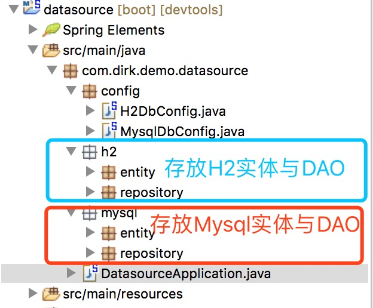

## Spring Boot配置多数据源

Spring Boot结合Spring Data JPA对于配置单数据源的情况非常简单，只需要在application.properties或application.yml中配置数据库连接参数即可。但在实际应用中，经常会使用到**多数据源**，尤其是各个数据源采用的是**不同的数据库**。

此示例展示连接两个数据源，一个为H2，一个为Mysql。其中H2数据库对应实体为Book，Mysql数据库对应实体为User，H2数据库作为主数据源。

#### 多数据源配置

1. 在application.properties文件中添加两个数据源的配置信息

```properties
## H2数据库配置
spring.datasource.h2.url=jdbc:h2:mem:example-app;DB_CLOSE_DELAY=-1;DB_CLOSE_ON_EXIT=FALSE
spring.datasource.h2.platform=h2
spring.datasource.h2.username=sa
spring.datasource.h2.password=
spring.datasource.h2.driverClassName=org.h2.Driver

## MySQL数据库配置
spring.datasource.mysql.url=jdbc:mysql://localhost:3306/demo?characterEncoding=utf-8
spring.datasource.mysql.platform=mysql
spring.datasource.mysql.username=root
spring.datasource.mysql.password=root
spring.datasource.mysql.driverClassName=com.mysql.jdbc.Driver
```

2. 在application.properties中设置SQL Dialect为“**default**”，由Spring根据数据库类型自动判断SQL Dialect

```properties
## 设置SQL Dialect为 "default"，由Spring自动检测SQL Dialect
spring.jpa.database=default
```

3. 为不同的数据库创建不同的Java包，分别存放实体与DAO



4. 创建H2数据库配置类“H2DbConfig.java”

```java
/**
 * H2数据源配置
 * @author Dirk
 *
 */
@Configuration
@EnableTransactionManagement
@EnableJpaRepositories(entityManagerFactoryRef="entityManagerFactory", transactionManagerRef="transactionManager", basePackages = {"com.dirk.demo.datasource.h2.repository"})
public class H2DbConfig {
	@Primary
	@Bean(name="entityManagerFactory")
	public LocalContainerEntityManagerFactoryBean entityManagerFactory(EntityManagerFactoryBuilder builder, @Qualifier("datasource")DataSource datasource) {
		return builder.dataSource(datasource).packages("com.dirk.demo.datasource.h2.entity").persistenceUnit("h2Unit").build();
	}
	
	@Primary
	@Bean(name="datasource")
	@ConfigurationProperties(prefix = "spring.datasource.h2")
	public DataSource dataSource() {
		return DataSourceBuilder.create().build();
	}
	
	@Primary
	@Bean(name="transactionManager")
	public PlatformTransactionManager transactionManager(@Qualifier("entityManagerFactory")EntityManagerFactory entityManagerFactory) {
		return new JpaTransactionManager(entityManagerFactory);
	}
}
```

@Primary注解表示此数据源为主数据源

@EnableJpaRepositories注解中的entityManagerFactoryRef表示引用的EntityManagerFactory，transactionManagerRef表示引用的TransactionManager，basePackages表示放在此包下的DAO使用此数据源

5. 创建MySql数据库配置类“MysqlDbConfig.java”

```java
/**
 * Mysql数据源配置
 * @author Dirk
 *
 */
@Configuration
@EnableTransactionManagement
@EnableJpaRepositories(entityManagerFactoryRef="mysqlEntityManagerFactory", transactionManagerRef="mysqlTransactionManager", basePackages = {"com.dirk.demo.datasource.mysql.repository"})
public class MysqlDbConfig {
	@Bean(name="mysqlEntityManagerFactory")
	public LocalContainerEntityManagerFactoryBean entityManagerFactory(EntityManagerFactoryBuilder builder, @Qualifier("mysqlDatasource")DataSource datasource) {
		return builder.dataSource(datasource).packages("com.dirk.demo.datasource.mysql.entity").persistenceUnit("mysqlUnit").build();
	}
	
	@Bean(name="mysqlDatasource")
	@ConfigurationProperties(prefix = "spring.datasource.mysql")
	public DataSource dataSource() {
		return DataSourceBuilder.create().build();
	}
	
	@Bean(name="mysqlTransactionManager")
	public PlatformTransactionManager transactionManager(@Qualifier("mysqlEntityManagerFactory")EntityManagerFactory entityManagerFactory) {
		return new JpaTransactionManager(entityManagerFactory);
	}
}
```

6. 为H2数据库创建实体“Book.java”，根据以上配置此实体必须放在com.dirk.demo.datasource.h2.entity包中

```java
@Entity
@Table(name = "t_book")
public class Book {
	
	@Id
	@GeneratedValue(strategy = GenerationType.IDENTITY)
	private Long id;
	private String name;
	private Double price;
	
	public Book() {
	}
	
	public Book(String name, Double price) {
		this.name = name;
		this.price = price;
	}

	public Long getId() {
		return id;
	}

	public void setId(Long id) {
		this.id = id;
	}

	public String getName() {
		return name;
	}

	public void setName(String name) {
		this.name = name;
	}

	public Double getPrice() {
		return price;
	}

	public void setPrice(Double price) {
		this.price = price;
	}
	
	@Override
	public String toString() {
		return "Book{" + "id=" + id + ", name='" + name + '\'' + ", price=" + price + '}';
	}
}
```

7. 为H2数据库创建DAO “BookRepository.java”，根据以上配置此DAO必须放在com.dirk.demo.datasource.h2.repository包中

```java
public interface BookRepository extends JpaRepository<Book, Long> {

}
```

8. 为Mysql数据库创建实体 “User.java”，注意放置位置

```java
@Entity
@Table(name="t_user")
public class User {
	@Id
	@GeneratedValue(strategy=GenerationType.IDENTITY)
	private Long id;
	private String name;
	private int age;
	
	public User() {
	}
	
	public User(String name, int age) {
		this.name = name;
		this.age = age;
	}

	public Long getId() {
		return id;
	}

	public void setId(Long id) {
		this.id = id;
	}

	public String getName() {
		return name;
	}

	public void setName(String name) {
		this.name = name;
	}

	public int getAge() {
		return age;
	}

	public void setAge(int age) {
		this.age = age;
	}
	
	@Override
	public String toString() {
		return "User{" + "id=" + id + ", name='" + name + '\'' + ", age=" + age + '}';
	}
}
```

9. 为Mysql数据库创建DAO "UserRepository.java"，注意放置位置

```java
public interface UserRepositry extends JpaRepository<User, Long>{

}
```

10. 创建SpringBoot的 Main方法

```java
@SpringBootApplication
public class DatasourceApplication {

	public static void main(String[] args) {
		SpringApplication.run(DatasourceApplication.class, args);
	}
}
```

11. 编写测试用例进行相关测试

```java
@RunWith(SpringRunner.class)
@SpringBootTest
public class DatasourceApplicationTests {
	
	@Autowired
	private BookRepository bookRepository;

	@Autowired
	private UserRepositry userRepository;
	
	public void contextLoads() {
	}
	
	@Test
	public void testFindAllBook() {
		List<Book> bookList = bookRepository.findAll();
		bookList.forEach(System.out::println);
	}
	
	@Test
	public void addBook() {
		Book book = new Book();
		book.setId(4L);
		book.setName("Spring in Action");
		book.setPrice(47.49);
		bookRepository.save(book);
		testFindAllBook();
	}
	
	@Test
	@Transactional
	public void testAddUser() {
		User user = new User();
		user.setName("小A");
		user.setAge(18);
		userRepository.save(user);
	}
	
	@Test
	public void findAllUser() {
		List<User> userList = userRepository.findAll();
		userList.forEach(System.out::println);
	}
}
```

至此，配置完成。